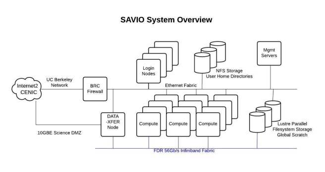
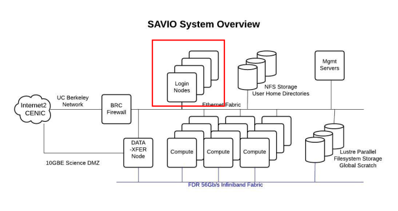
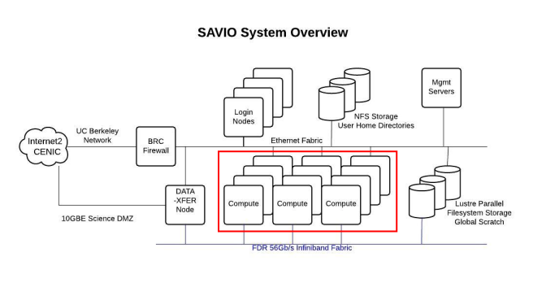
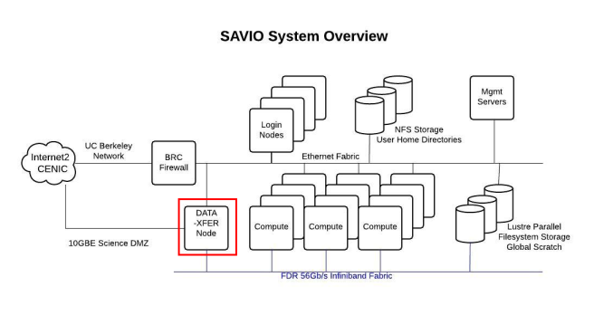
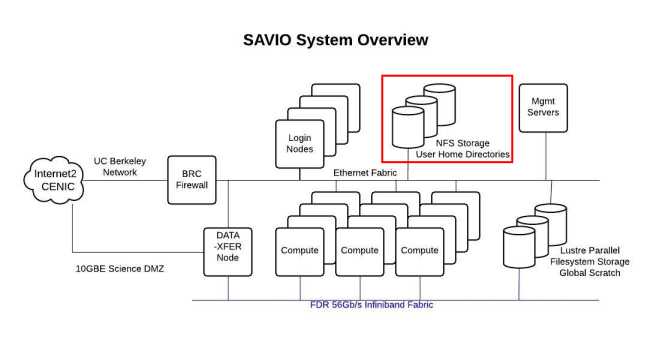
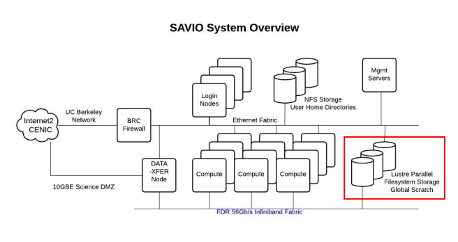

# Software Prerequisites

# Software Prerequisites
	
- **git** for data transfer (scripts and small files)
  - should come installed by default on macOS

# Software Prerequisites
	
- **git** for data transfer (scripts and small files)
  - should come installed by default on macOS
- **homebrew** for installing software locally
  - https://brew.sh/

# Software Prerequisites
	
- **git** for data transfer (scripts and small files)
  - should come installed by default on macOS
- **homebrew** for installing software locally
  - https://brew.sh/
- **rsync** for data transfer (large files) between savio and your computer
```{r, engine = 'bash', eval = FALSE}
brew install rsync
```

# Software Prerequisites
	
- **git** for data transfer (scripts and small files)
  - should come installed by default on macOS
- **homebrew** for installing software locally
  - https://brew.sh/
- **rsync** for data transfer (large files) between savio and your computer
```{r, engine = 'bash', eval = FALSE}
brew install rsync
```
- **rclone** for data transfer (large files) between savio, BOX, and your computer
```{r, engine = 'bash', eval = FALSE}
brew install rclone
```

# Software Prerequisites
	
- **git** for data transfer (scripts and small files)
  - should come installed by default on macOS
- **homebrew** for installing software locally
  - https://brew.sh/
- **rsync** for data transfer (large files) between savio and your computer
```{r, engine = 'bash', eval = FALSE}
brew install rsync
```
- **rclone** for data transfer (large files) between savio, BOX, and your computer
```{r, engine = 'bash', eval = FALSE}
brew install rclone
```
- (smartphone) **Google Authenticator** for logging in to savio with one-time passwords
  - https://docs-research-it.berkeley.edu/services/high-performance-computing/user-guide/setting-otp/

# Introduction to savio

# Introduction to savio

<p align="center">
  
</p>

There are two types of things you need to worry about: **nodes** and **file systems** (hard drives).

# Introduction to savio

<p align="center">
  
</p>

**Nodes** are self-contained computers.
They come in three varieties.

# Introduction to savio

<p align="center">
  
</p>

**Login nodes** (AKA **head nodes**) are where you login!
This is also where you submit jobs.

_**NEVER**_ run serious programs here.

# Introduction to savio

<p align="center">
  
</p>

**Compute nodes** are where your jobs are executed.

You should not log in to a compute node (unless you're doing an interactive job...).
Jobs you submit on a login node are assigned to a compute node by the system.

# Introduction to savio

<p align="center">
  
</p>

The **data transfer node** is where you login when you want to move large data files to and from savio.

I try to avoid logging into transfer nodes, and instead write scripts to move data back and forth.

# Introduction to savio

<p align="center">
  
</p>

There are two file systems (basically, sets of hard drives).

# Introduction to savio

<p align="center">
  
</p>

There are two file systems (basically, sets of hard drives).

**NFS** is where your _home_ directory (`~`) is.
You are limited to 10 gb in our home directory, so avoid storing large data files here.
I typically use it for installing programs.

# Introduction to savio

<p align="center">
  
</p>

There are two file systems (basically, sets of hard drives).

**Lustre** is where all of your jobs should live.
Each user has a `scratch` directory here, with essentially unlimited space.
However, it's supposed to be swept every so often to delete "stale" files.
(They warn you before they do this, and are usually pretty lax.)

# Introduction to savio

<p align="center">
  
</p>

There are two file systems (basically, sets of hard drives).

To get to your `scratch` directory (either in a login node, or on a compute node), use:
```{r, engine = 'bash', eval = FALSE}
cd /global/scratch/users/<YOUR USER NAME>
```

# Introduction to savio

Each IB faculty gets 300,000 CPU (core) hours per year. (A "faculty computing allowance", or FCA.)

# Introduction to savio

Each IB faculty gets 300,000 CPU (core) hours per year. (A "faculty computing allowance", or FCA.)

It seems like a lot, but you'd be surprised how fast they disappear!

# Introduction to savio

Each IB faculty gets 300,000 CPU (core) hours per year. (A "faculty computing allowance", or FCA.)

It seems like a lot, but you'd be surprised how fast they disappear!

**IMPORTANT:** When you request a node, _you are charged for all the cores on that node whether or not you use them!_ We'll return to this later.

# Introduction to savio

Each IB faculty gets 300,000 CPU (core) hours per year. (A "faculty computing allowance", or FCA.)

It seems like a lot, but you'd be surprised how fast they disappear!

**IMPORTANT:** When you request a node, _you are charged for all the cores on that node whether or not you use them!_ We'll return to this later.

If you haven't already, request an account and get added to Carl (or another PI's) allowance [HERE](https://docs-research-it.berkeley.edu/services/high-performance-computing/getting-account/#getting-access-to-a-project).

# Introduction to savio

savio uses "modules" for pre-installed programs.

# Introduction to savio

savio uses "modules" for pre-installed programs.

To load a module (make the program available for use), do something like:
```{r, engine = 'bash', eval = FALSE}
module load revbayes
```
(Rememeber to do this in any `SLURM` scripts that use the programs, too.)

# Introduction to savio

savio uses "modules" for pre-installed programs.

To load a module (make the program available for use), do something like:
```{r, engine = 'bash', eval = FALSE}
module load revbayes
```
(Rememeber to do this in any `SLURM` scripts that use the programs, too.)

You can see the list of available modules using:
```{r, engine = 'bash', eval = FALSE}
module avail
```

# Introduction to savio

- Online resources:
  - [introduction to HPC/savio](https://docs-research-it.berkeley.edu/services/high-performance-computing/overview/)
  - [system overview](https://docs-research-it.berkeley.edu/services/high-performance-computing/overview/system-overview/)
  - [data storage](https://docs-research-it.berkeley.edu/services/high-performance-computing/user-guide/data/storing-data/)
  - [account setup](https://docs-research-it.berkeley.edu/services/high-performance-computing/getting-account/#getting-access-to-a-project)
  - [user guide](https://docs-research-it.berkeley.edu/services/high-performance-computing/user-guide/)

# git, savio, and data transfer

# git, savio, and data transfer

<p align="center">
  
</p>

There are four systems involved.

# git, savio, and data transfer

<p align="center">
  
</p>

Two of them are "temporary" (my local machine, and savio)---these may get lost or deleted!

The other two are "archives" (git and BOX)---these should stay around forever!

# git, savio, and data transfer

<p align="center">
  
</p>

I use different methods to transfer small files (tracked in the repo) and large files (stored in BOX).

# git, savio, and data transfer

<p align="center">
  
</p>

I track all my small files using a git repository.
Then I use push and pull (/clone) to synchronize savio with my local repository.

# git, savio, and data transfer

<p align="center">
  
</p>

I use `rclone` to transfer large files to savio.
(You can also use `Globus`, `sftp`, `lftp`, `scp`, etc. I like `rclone`)

# git, savio, and data transfer

<p align="center">
  
</p>

I have one set of `rclone` scripts that transfer data from my local machine to BOX, then from BOX to savio.

# git, savio, and data transfer

<p align="center">
  
</p>

I have one set of `rclone` scripts that transfer data from my local machine to BOX, then from BOX to savio.

And another set to transfer from savio to BOX, then from BOX to my local machine (if necessary).

# git, savio, and data transfer

Imagine I'm working with a git repository.

I may clone or create a repo on my local machine.

```{r, engine = 'bash', eval = FALSE}
git clone https://mrmay@bitbucket.org/mrmay/savio_workflow.git
```

# git, savio, and data transfer

I make some local changes, stage and commit them, and then push them to the remote.

```{r, engine = 'bash', eval = FALSE}
git stage .
git commit -m "some new changes!"
git pull
git push
```

# git, savio, and data transfer

Now I want to get those changes onto savio.

I log into savio, and navigate to my scratch directory
```{r, engine = 'bash', eval = FALSE}
# log in to savio
ssh mrmay@hpc.brc.berkeley.edu

# change to my scratch directory
cd /global/scratch/users/mrmay
```

# git, savio, and data transfer

If this is the first time using the repo with savio, I clone the repo:
```{r, engine = 'bash', eval = FALSE}
# clone
git clone https://mrmay@bitbucket.org/mrmay/savio_workflow.git

# change to that directory
cd savio_workflow
```

# git, savio, and data transfer

If this is the first time using the repo with savio, I clone the repo:
```{r, engine = 'bash', eval = FALSE}
# clone
git clone https://mrmay@bitbucket.org/mrmay/savio_workflow.git

# change to that directory
cd savio_workflow
```

Otherwise, I navigate to the repo and pull my new changes
```{r, engine = 'bash', eval = FALSE}
# change to that directory
cd savio_workflow

# pull
git pull
```

# git, savio, and data transfer

But how do I transfer big data files?

# git, savio, and data transfer

But how do I transfer big data files?

If I have a big file (e.g. a big sequence alignment), I put it somewhere in my **local** repository, but make sure to put it on my `.gitignore`!

```{r, engine = 'bash', eval = FALSE}
# Here I am creating a fake data file, 
# but imagine it's your huge genomic data
touch data/big_data.zip
```

# git, savio, and data transfer

But how do I transfer big data files?

If I have a big file (e.g. a big sequence alignment), I put it somewhere in my **local** repository, but make sure to put it on my `.gitignore`!

```{r, engine = 'bash', eval = FALSE}
# Here I am creating a fake data file, 
# but imagine it's your huge genomic data
touch data/big_data.zip
```

Then I open my `.gitignore` file:
```{r, engine = 'bash', eval = FALSE}
nano .gitignore
```
and add ``data/big_data.zip``, then save and close.
(You can use any text editor to do this.)

(Remember to stage/commit/push changes to your `.gitignore`.)

# git, savio, and data transfer

A nice, scriptable solution for moving individual files is ``rsync``.

# git, savio, and data transfer

A nice, scriptable solution for moving individual files is ``rsync``.

I'm going to use `rsync` to transfer my data file, and return to _automating_ this for large data files later, when I talk about `rclone`.

# git, savio, and data transfer

A nice, scriptable solution for moving individual files is ``rsync``.

I'm going to use `rsync` to transfer my data file, and return to _automating_ this for large data files later, when I talk about `rclone`.

On my **local machine**, I use ``rsync`` like so, to send my file to savio:
```{r, engine = 'bash', eval = FALSE}
rsync -a data/big_data.zip mrmay@dtn.brc.berkeley.edu:/global/scratch/users/mrmay/savio_workflow/data
```

# git, savio, and data transfer

A nice, scriptable solution for moving individual files is ``rsync``.

I'm going to use `rsync` to transfer my data file, and return to _automating_ this for large data files later, when I talk about `rclone`.

On my **local machine**, I use ``rsync`` like so, to send my file to savio:
```{r, engine = 'bash', eval = FALSE}
rsync -a data/big_data.zip mrmay@dtn.brc.berkeley.edu:/global/scratch/users/mrmay/savio_workflow/data
```

**NOTE:**

- _**I'm using the data transfer node!**_
- `-a` is "archive" mode: it only updates the remote file if it's changed.
- The first argument is the _relative path to the file I want to transfer_, and the second argument is the _absolute path to the directory I want to move the file to_.

# git, savio, and data transfer

Just to make sure the file transferred, on **savio**:
```{r, engine = 'bash', eval = FALSE}
ls data/
```

# Running jobs on savio

Now, let's submit some jobs!

# Running jobs on savio

Now, let's submit some jobs!

savio uses the batch submission software `SLURM`.

# Running jobs on savio

Now, let's submit some jobs!

savio uses the batch submission software `SLURM`.

`SLURM` is reponsible for coordinating everyone's jobs in the most efficient and fair way possible.

# Running jobs on savio

Now, let's submit some jobs!

savio uses the batch submission software `SLURM`.

`SLURM` is reponsible for coordinating everyone's jobs in the most efficient and fair way possible.

This means your job has a certain priority based on how much time you request, and how much you have used the system recently!
Sometimes you may sit in the queue for a while (in my experience, up to a day if you're doing lots of log jobs).

# Running jobs on savio

Here is what a `SLURM` script looks like:
```{r, engine = 'bash', eval = FALSE}
#!/bin/bash
#SBATCH --partition=savio
#SBATCH --account=fc_rothfelslab
#SBATCH --qos=savio_normal
#SBATCH --job-name=simple_example
#SBATCH --mail-user=mikeryanmay@gmail.edu
#SBATCH --mail-type=ALL
#SBATCH --nodes=1
#SBATCH --time=00:00:30

# change to user directory
old_dir=$(pwd)
cd /global/scratch/users/$USER/savio_workflow/simple/

# make the output directory
mkdir -p output

# run your code
echo "Hello World" > output/simple.txt

# move log file
mkdir -p log
mv "${old_dir}/slurm-${SLURM_JOB_ID}.out" "log/slurm-${SLURM_JOB_ID}.out"
```

# Running jobs on savio

Let's submit our job!

```{r, engine = 'bash', eval = FALSE}
sbatch simple/simple.sh
```

# Running jobs on savio

We can check our job(s) in the queue like so:
```{r, engine = 'bash', eval = FALSE}
squeue -u $USER
```
(this is a short job, so don't be surprised if it's finished by the time you use `squeue`!)

# Running jobs on savio

When you request one compute node, you get charged for all 20 cores on that node whether you use them!

The amount you get charged is nodes x cores x how long the job ran (not how much time you requested).

So, you want to either: 1) use all the cores for a given job, or 2) run multiple jobs simultaneously.

# Running jobs on savio

Let's check out a more efficient script.
```{r, engine = 'bash', eval = FALSE}
# run your task
echo "Task 1"  >  output/multiple.txt &
echo "Task 2"  >> output/multiple.txt &
echo "Task 3"  >> output/multiple.txt &
echo "Task 4"  >> output/multiple.txt &
echo "Task 5"  >> output/multiple.txt &
echo "Task 6"  >> output/multiple.txt &
echo "Task 7"  >> output/multiple.txt &
echo "Task 8"  >> output/multiple.txt &
echo "Task 9"  >> output/multiple.txt &
echo "Task 10" >> output/multiple.txt &
echo "Task 11" >> output/multiple.txt &
echo "Task 12" >> output/multiple.txt &
echo "Task 13" >> output/multiple.txt &
echo "Task 14" >> output/multiple.txt &
echo "Task 15" >> output/multiple.txt &
echo "Task 16" >> output/multiple.txt &
echo "Task 17" >> output/multiple.txt &
echo "Task 18" >> output/multiple.txt &
echo "Task 19" >> output/multiple.txt &
echo "Task 20" >> output/multiple.txt;

wait;
```

# Running jobs on savio

DEMO

# Running jobs on savio

You may notice that my `.gitignore` file ignores everything in `log` and `output` directories!

# Running jobs on savio

You may notice that my `.gitignore` file ignores everything in `log` and `output` directories!

How am I going to get my files?!?!?!

# Data transfer with `rclone`

# Data transfer with `rclone`

<p align="center">
  
</p>

# Data transfer with `rclone`

The first thing I need to do is setup some BOX remotes.

# Data transfer with `rclone`

The first thing I need to do is setup some BOX remotes.

On my **local machine**, I enter `rclone` configuration like so:

```{r, engine = 'bash', eval = FALSE}
rclone config
```

# Data transfer with `rclone`

The first thing I need to do is setup some BOX remotes.

On my **local machine**, I enter `rclone` configuration like so:

```{r, engine = 'bash', eval = FALSE}
rclone config
```

DEMO TIME!

# Data transfer with `rclone`

The first thing I need to do is setup some BOX remotes.

On my **local machine**, I enter `rclone` configuration like so:

```{r, engine = 'bash', eval = FALSE}
rclone config
```

DEMO TIME!

I then login to the **data transfer node** and repeat.
```{r, engine = 'bash', eval = FALSE}
# log in to savio DTN!
ssh mrmay@dtn.brc.berkeley.edu
```

# Data transfer with `rclone`

Now, I can use `rclone` to synchronize files between storage locations.

# Data transfer with `rclone`

Now, I can use `rclone` to synchronize files between storage locations.

To transfer a file from my local machine to BOX, I do this:
```{r, engine = 'bash', eval = FALSE}
rclone sync data/ MY_BOX:savio_workflow/data
```

# Data transfer with `rclone`

Now, I can use `rclone` to synchronize files between storage locations.

To transfer a file from my local machine to BOX, I do this:
```{r, engine = 'bash', eval = FALSE}
rclone sync data/ MY_BOX:savio_workflow/data
```

The first argument (`sync`) means the remote files will only be updated if they're out of date!

The second argument (`data/`) is the file (or directories) I want to send to the remote.

The third (`MY_BOX:savio_workflow/data`) is the destination on BOX.

# Data transfer with `rclone`

I write bash scripts to automate this procedure, so that files go into the right place every time.

# Data transfer with `rclone`

I write bash scripts to automate this procedure, so that files go into the right place every time.

I also have scripts that transfer from savio to BOX. To use these scripts, login to the data transfer node and do something like:
```{r, engine = 'bash', eval = FALSE}
bash synchronizers/synchronize_savio_to_box.sh
```

# Data transfer with `rclone`

I write bash scripts to automate this procedure, so that files go into the right place every time.

I also have scripts that transfer from savio to BOX. To use these scripts, login to the data transfer node and do something like:
```{r, engine = 'bash', eval = FALSE}
bash synchronizers/synchronize_savio_to_box.sh
```

**BEWARE of relative file paths.** To be consistent, I write my scripts to **run** from the top-level directory in my repository!

# Conclusions

- Setting this system up can be time consuming! But I think it pays off in the end.
- It's nice to have permanent backups of your code and files. This makes your work safer and easier to share.
- This is just one example of a workflow: you could use `rclone` to transfer ALL of your files, and not use git! Or, you could use something other than `rclone` for file transfer, like `Globus` or `lftp`.


