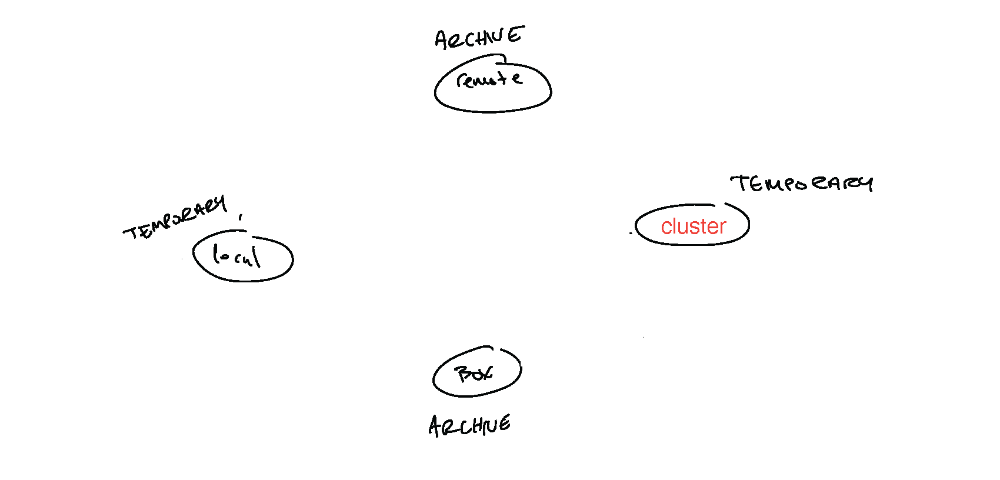
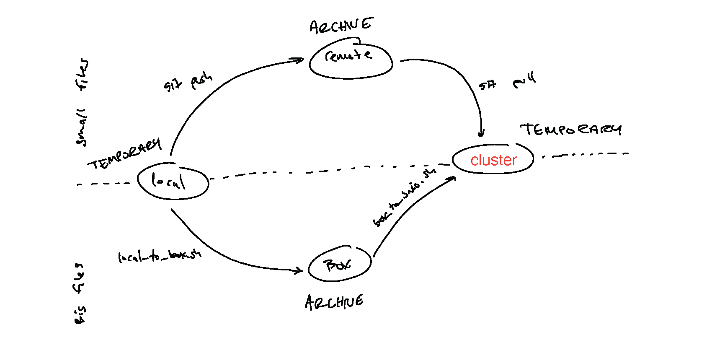

# Software Prerequisites (on local machine)

# Software Prerequisites (on local machine)
	
- **git** for data transfer (scripts and small files)
  - should come installed by default on macOS
- **GitHub Desktop** (optional but it's nice so I recommend it)

# Software Prerequisites (on local machine)
	
- **git** for data transfer (scripts and small files)
  - should come installed by default on macOS
- **GitHub Desktop** (optional but it's nice so I recommend it)
- **homebrew** for installing software locally
  - https://brew.sh/

# Software Prerequisites (on local machine)
	
- **git** for data transfer (scripts and small files)
  - should come installed by default on macOS
- **GitHub Desktop** (optional but it's nice so I recommend it)
- **homebrew** for installing software locally
  - https://brew.sh/
- **rsync** for data transfer (large files) between CHPC and your computer
```{r, engine = 'bash', eval = FALSE}
brew install rsync
```

# Software Prerequisites (on local machine)
	
- **git** for data transfer (scripts and small files)
  - should come installed by default on macOS
- **GitHub Desktop** (optional but it's nice so I recommend it)
- **homebrew** for installing software locally
  - https://brew.sh/
- **rsync** for data transfer (large files) between CHPC and your computer
```{r, engine = 'bash', eval = FALSE}
brew install rsync
```
- **rclone** for data transfer (large files) between CHPC, BOX, and your computer
```{r, engine = 'bash', eval = FALSE}
brew install rclone
```

# Software Prerequisites (on local machine)
	
- **git** for data transfer (scripts and small files)
  - should come installed by default on macOS
- **GitHub Desktop** (optional but it's nice so I recommend it)
- **homebrew** for installing software locally
  - https://brew.sh/
- **rsync** for data transfer (large files) between CHPC and your computer
```{r, engine = 'bash', eval = FALSE}
brew install rsync
```
- **rclone** for data transfer (large files) between CHPC, BOX, and your computer
```{r, engine = 'bash', eval = FALSE}
brew install rclone
```

# Introduction to CHPC

# Introduction to CHPC

<p align="center">
  
</p>

There are two types of things you need to worry about: **nodes** and **file systems** (hard drives).

# Introduction to CHPC

<p align="center">
  
</p>

**Nodes** are self-contained computers.
They come in three varieties.

# Introduction to CHPC

<p align="center">
  
</p>

**Login nodes** (AKA **head nodes**) are where you login!
This is also where you submit jobs.

_**NEVER**_ run serious programs here. Even moving or copying large files can be a problem (more on that later). 

# Introduction to CHPC

<p align="center">
  
</p>

**Compute nodes** are where your jobs are executed.

You should generally not log in to a compute node (unless you're doing an interactive job...).
Jobs you submit on a login node are assigned to a compute node by the system.

# Introduction to CHPC

<p align="center">
  
</p>

The **data transfer node** is where you login when you want to move large data files to and from CHPC

I try to avoid logging into transfer nodes, and instead write scripts to move data back and forth. 

# Introduction to CHPC

<p align="center">
  
</p>

There are two file systems (basically, sets of hard drives).

# Introduction to CHPC

<p align="center">
  
</p>

There are two file systems (basically, sets of hard drives).

In your _home_ directory (`~`) you are limited to 50 GB of space, but the data are not backed up!
This is the location you will want to intstall programs (if needed).

# Introduction to CHPC

<p align="center">
  
</p>

There are two file systems (basically, sets of hard drives).

**scratch** is where all of your jobs should live. Within `/scratch/` there are two file systems:
* `/scratch/general/nfs1` - a 595 TB NFS system accessible from all general environment CHPC resources 
* `/scratch/general/vast` - 1 PB  file system available from all general environment CHPC resources; quota of 50 TB per user

Each user can make their own `scratch` directory here, with essentially unlimited space (essentially!).
However, there is a strict purging policy. **Files that have not been accessed for 60 days are automatically scrubbed!** These files are also not backed up.

# Introduction to CHPC

<p align="center">
  
</p>

There are two file systems (basically, sets of hard drives).

To get to your `scratch` directory (either in a login node, or on a compute node), use:
```{r, engine = 'bash', eval = FALSE}
cd /scratch/general/nfs1
```
or
```{r, engine = 'bash', eval = FALSE}
cd /scratch/general/vast
```
then create a directory for yourself with:
```{r, engine = 'bash', eval = FALSE}
mkdir u6049165 
```
Note that everyone will be able to see your directory name in the list but they won't be able to access the contents, unless you specifically give access to them. 

# Introduction to CHPC

Each USU faculty account can request up to 300,000 CPU (core) hours per quarter (For the "normal allocation request.") You will have to submit a request form 1-4 times per year and justify your allocation amount. 

# Introduction to CHPC

Each USU faculty account can request up to 300,000 CPU (core) hours per quarter (For the "normal allocation request.") You will have to submit a request form 1-4 times per year and justify your allocation amount. 

It seems like a lot, but you'd be surprised how fast they disappear!

# Introduction to CHPC

Each USU faculty account can request up to 300,000 CPU (core) hours per quarter (For the "normal allocation request.") You will have to submit a request form 1-4 times per year and justify your allocation amount. 

It seems like a lot, but you'd be surprised how fast they disappear!

**IMPORTANT:** When you request a node for a job, _you are charged for all the cores on that node whether or not you use them!_ We'll return to this later.

# Introduction to CHPC

Each USU faculty account can request up to 300,000 CPU (core) hours per quarter (For the "normal allocation request.") You will have to submit a request form 1-4 times per year and justify your allocation amount. 

It seems like a lot, but you'd be surprised how fast they disappear!

**IMPORTANT:** When you request a node for a job, _you are charged for all the cores on that node whether or not you use them!_ We'll return to this later.

If you haven't already, find instructions to request an account and get added to Carl (or another PI's) allowance [HERE](https://usu.box.com/s/12ymsgw947qd1jouvu5iuior5eeotzdg).

# Introduction to CHPC

CHPC uses "modules" for pre-installed programs.

# Introduction to CHPC

CHPC uses "modules" for pre-installed programs.

To load a module (make the program available for use), do something like:
```{r, engine = 'bash', eval = FALSE}
module load revbayes
```
(Rememeber to do this in any `SLURM` scripts that use the programs, too.)

# Introduction to CHPC

CHPC uses "modules" for pre-installed programs.

To load a module (make the program available for use), do something like:
```{r, engine = 'bash', eval = FALSE}
module load revbayes
```
(Rememeber to do this in any `SLURM` scripts that use the programs, too.)

You can see the list of available modules using:
```{r, engine = 'bash', eval = FALSE}
module avail
```

You can search for a particular modlule with a keyword, for example "`iqtree`," like so:
```{r, engine = 'bash', eval = FALSE}
module spider iqtree
```

# Introduction to CHPC

- Online resources:
  - [CHPC Getting Started Guide](https://www.chpc.utah.edu/documentation/gettingstarted.php)
  - [Access Overview](https://www.chpc.utah.edu/resources/access.php)
  - [Allocation Information](https://www.chpc.utah.edu/userservices/allocations.php)

# git, CHPC, and data transfer

# git, CHPC, and data transfer

<p align="center">
  
</p>

There are four systems involved.

# git, CHPC, and data transfer

<p align="center">
  
</p>

Two of them are "temporary" (my local machine, and CHPC)---these may get lost or deleted!

The other two are "archives" (git and BOX)---these should stay around forever!

# git, CHPC, and data transfer

<p align="center">
  
</p>

I use different methods to transfer small files (tracked in the repo) and large files (stored in BOX).

# git, CHPC, and data transfer

<p align="center">
  
</p>

I track all my small files using a git repository.
Then I use push and pull (/clone) to synchronize CHPC with my local repository.

# git, CHPC, and data transfer

<p align="center">
  
</p>

I use `rclone` to transfer large files to CHPC.
(You can also use `Globus`, `sftp`, `lftp`, `scp`, etc. I like `rclone`)

# git, CHPC, and data transfer

<p align="center">
  
</p>

I have one set of `rclone` scripts that transfer data from my local machine to BOX, then from BOX to CHPC.

# git, CHPC, and data transfer

<p align="center">
  
</p>

I have one set of `rclone` scripts that transfer data from my local machine to BOX, then from BOX to CHPC.

And another set to transfer from CHPC to BOX, then from BOX to my local machine (if necessary).

# git, CHPC, and data transfer

Imagine I'm working with a git repository.

I may clone or create a repo on my local machine.

```{r, engine = 'bash', eval = FALSE}
git clone https://github.com/jenna-tb-ekwealor/chpc_workflow.git
```

# git, CHPC, and data transfer

I make some local changes, stage and commit them, and then push them to the remote.

```{r, engine = 'bash', eval = FALSE}
git add .
git commit -m "some new changes!"
git pull
git push
```

# git, CHPC, and data transfer

Now I want to get those changes onto CHPC

I log into CHPC, and navigate to my scratch directory
```{r, engine = 'bash', eval = FALSE}
# log in to CHPC, for instance notchpeak
ssh u6049165@notchpeak.chpc.utah.edu

# change to my scratch directory
cd /scratch/general/nfs1/u6049165
```

# git, CHPC, and data transfer

If this is the first time using the repo with CHPC, I clone the repo:
```{r, engine = 'bash', eval = FALSE}
# clone
git clone https://github.com/jenna-tb-ekwealor/chpc_workflow.git

# change to that directory
cd chpc_workflow
```

# git, CHPC, and data transfer

If this is the first time using the repo with CHPC, I clone the repo:
```{r, engine = 'bash', eval = FALSE}
# clone
git clone https://github.com/jenna-tb-ekwealor/chpc_workflow.git

# change to that directory
cd chpc_workflow
```

Otherwise, I navigate to the repo and pull my new changes
```{r, engine = 'bash', eval = FALSE}
# change to that directory
cd chpc_workflow

# pull
git pull
```

# git, CHPC, and data transfer

But how do I transfer big data files?

# git, CHPC, and data transfer

But how do I transfer big data files?

If I have a big file (e.g. a big sequence alignment), I put it somewhere in my **local** repository, but make sure to put it on my `.gitignore`!

```{r, engine = 'bash', eval = FALSE}
# Here I am creating a fake data file, 
# but imagine it's your huge genomic data
touch data/big_data.zip
```

# git, CHPC, and data transfer

But how do I transfer big data files?

If I have a big file (e.g. a big sequence alignment), I put it somewhere in my **local** repository, but make sure to put it on my `.gitignore`!

```{r, engine = 'bash', eval = FALSE}
# Here I am creating a fake data file, 
# but imagine it's your huge genomic data
touch data/big_data.zip
```

Then I open my `.gitignore` file:
```{r, engine = 'bash', eval = FALSE}
nano .gitignore
```
and add ``data/big_data.zip``, then save and close.
(You can use any text editor to do this.)

(Remember to stage/commit/push changes to your `.gitignore`.)

# git, CHPC, and data transfer

A nice, scriptable solution for moving individual files is ``rsync``.

# git, CHPC, and data transfer

A nice, scriptable solution for moving individual files is ``rsync``.

I'm going to use `rsync` to transfer my data file, and return to _automating_ this for large data files later, when I talk about `rclone`.

# git, CHPC, and data transfer

A nice, scriptable solution for moving individual files is ``rsync``.

I'm going to use `rsync` to transfer my data file, and return to _automating_ this for large data files later, when I talk about `rclone`.

On my **local machine**, I use ``rsync`` like so, to send my file to CHPC:
```{r, engine = 'bash', eval = FALSE}
rsync -a data/big_data.zip u6049165@dtn05.chpc.utah.edu:/scratch/general/nfs1/u6049165/chpc_workflow/data/
```
(Another option is to use a file transer GUI like FileZilla or CyberDuck but we're not covering that today.)

# git, CHPC, and data transfer

A nice, scriptable solution for moving individual files is ``rsync``.

I'm going to use `rsync` to transfer my data file, and return to _automating_ this for large data files later, when I talk about `rclone`.

On my **local machine**, I use ``rsync`` like so, to send my file to CHPC:
```{r, engine = 'bash', eval = FALSE}
rsync -a data/big_data.zip u6049165@dtn05.chpc.utah.edu:/scratch/general/nfs1/u6049165/chpc_workflow/data/
```

**NOTE:**

- _**I'm using the data transfer node!**_ See more about those [here](https://www.chpc.utah.edu/documentation/data_services.php#Data_Transfer_Nodes).
- `-a` is "archive" mode: it only updates the remote file if it's changed.
- The first argument is the _relative path to the file I want to transfer_, and the second argument is the _absolute path to the directory I want to move the file to_.

# git, CHPC, and data transfer

Just to make sure the file transferred, on **CHPC**:
```{r, engine = 'bash', eval = FALSE}
ls data/
```

# Running jobs on CHPC

Now, let's submit some jobs!

# Running jobs on CHPC

Now, let's submit some jobs!

CHPC uses the batch submission software `SLURM`.

# Running jobs on CHPC

Now, let's submit some jobs!

CHPC uses the batch submission software `SLURM`.

`SLURM` is reponsible for coordinating everyone's jobs in the most efficient and fair way possible.

# Running jobs on CHPC

Now, let's submit some jobs!

CHPC uses the batch submission software `SLURM`.

`SLURM` is reponsible for coordinating everyone's jobs in the most efficient and fair way possible.

This means your job has a certain priority based on how much time you request, and how much you have used the system recently!
Sometimes you may sit in the queue for a while (in my experience, up to a day if you're doing lots of log jobs).

# Running jobs on CHPC

Here is what a `SLURM` script looks like:
```{r, engine = 'bash', eval = FALSE}
#!/bin/bash
#SBATCH
#SBATCH --time=00:10:00
#SBATCH --nodes=1
# additional information for allocated clusters
#SBATCH --account=rothfels
#SBATCH --partition=notchpeak
#SBATCH --mail-type=FAIL,BEGIN,END
#
#
# ----------------Modules------------------------- #
#
#
# ----------------Your Commands------------------- #
#

# change to user directory of choice
old_dir=$(pwd)
cd /scratch/general/nfs1/u6049165/chpc_workflow/simple/

# make the output directory
mkdir -p output

# run your code
echo "Hello World" > output/simple.txt

# move log file
mkdir -p log
mv "${old_dir}/slurm-${SLURM_JOB_ID}.out" "log/slurm-${SLURM_JOB_ID}.out"
```

# Running jobs on CHPC

Let's submit our job!

```{r, engine = 'bash', eval = FALSE}
sbatch simple/simple.sh
```

# Running jobs on CHPC

We can check our job(s) in the queue like so:
```{r, engine = 'bash', eval = FALSE}
squeue -u $USER
```
(this is a short job, so don't be surprised if it's finished by the time you use `squeue`!)

# Running jobs on CHPC

When you request one compute node, you get charged for all 20 cores on that node whether you use them!

The amount you get charged is nodes x cores x how long the job ran (not how much time you requested).

So, you want to either: (1) use all the cores for a given job, or (2) run multiple jobs simultaneously.

# Running jobs on CHPC

Let's check out a more efficient script.
```{r, engine = 'bash', eval = FALSE}
# run your task
echo "Task 1"  >  output/multiple.txt &
echo "Task 2"  >> output/multiple.txt &
echo "Task 3"  >> output/multiple.txt &
echo "Task 4"  >> output/multiple.txt &
echo "Task 5"  >> output/multiple.txt &
echo "Task 6"  >> output/multiple.txt &
echo "Task 7"  >> output/multiple.txt &
echo "Task 8"  >> output/multiple.txt &
echo "Task 9"  >> output/multiple.txt &
echo "Task 10" >> output/multiple.txt &
echo "Task 11" >> output/multiple.txt &
echo "Task 12" >> output/multiple.txt &
echo "Task 13" >> output/multiple.txt &
echo "Task 14" >> output/multiple.txt &
echo "Task 15" >> output/multiple.txt &
echo "Task 16" >> output/multiple.txt &
echo "Task 17" >> output/multiple.txt &
echo "Task 18" >> output/multiple.txt &
echo "Task 19" >> output/multiple.txt &
echo "Task 20" >> output/multiple.txt;

wait;
```

# Running jobs on CHPC

DEMO

# Running jobs on CHPC

You may notice that my `.gitignore` file ignores everything in `log` and `output` directories!

# Running jobs on CHPC

You may notice that my `.gitignore` file ignores everything in `log` and `output` directories!

How am I going to get my files?!?!?!

# Data transfer with `rclone`

# Data transfer with `rclone`

<p align="center">
  
</p>

# Data transfer with `rclone`

The first thing I need to do is setup some BOX remotes.

# Data transfer with `rclone`

The first thing I need to do is setup some BOX remotes.

On my **local machine**, I enter `rclone` configuration like so:

```{r, engine = 'bash', eval = FALSE}
rclone config
```

# Data transfer with `rclone`

The first thing I need to do is setup some BOX remotes.

On my **local machine**, I enter `rclone` configuration like so:

```{r, engine = 'bash', eval = FALSE}
rclone config
```

DEMO TIME!

# Data transfer with `rclone`

The first thing I need to do is setup some BOX remotes.

On my **local machine**, I enter `rclone` configuration like so:

```{r, engine = 'bash', eval = FALSE}
rclone config
```

DEMO TIME!

I then login to the **data transfer node** and repeat.
```{r, engine = 'bash', eval = FALSE}
# log in to CHPC DTN!
ssh mrmay@dtn.brc.berkeley.edu
```

# Data transfer with `rclone`

Now, I can use `rclone` to synchronize files between storage locations.

# Data transfer with `rclone`

Now, I can use `rclone` to synchronize files between storage locations.

To transfer a file from my local machine to BOX, I do this:
```{r, engine = 'bash', eval = FALSE}
rclone sync data/ MY_BOX:chpc_workflow/data/
```

# Data transfer with `rclone`

Now, I can use `rclone` to synchronize files between storage locations.

To transfer a file from my local machine to BOX, I do this:
```{r, engine = 'bash', eval = FALSE}
rclone sync data/ MY_BOX:chpc_workflow/data/
```

The first argument (`sync`) means the remote files will only be updated if they're out of date!

The second argument (`data/`) is the file (or directories) I want to send to the remote.

The third (`MY_BOX:chpc_workflow/data/`) is the destination on BOX.

# Data transfer with `rclone`

I write bash scripts to automate this procedure, so that files go into the right place every time.

# Data transfer with `rclone`

I write bash scripts to automate this procedure, so that files go into the right place every time.

I also have scripts that transfer from CHPC to BOX. To use these scripts, login to the data transfer node and do something like:
```{r, engine = 'bash', eval = FALSE}
bash synchronizers/synchronize_CHPC_to_box.sh
```

# Data transfer with `rclone`

I write bash scripts to automate this procedure, so that files go into the right place every time.

I also have scripts that transfer from CHPC to BOX. To use these scripts, login to the data transfer node and do something like:
```{r, engine = 'bash', eval = FALSE}
bash synchronizers/synchronize_CHPC_to_box.sh
```

**BEWARE of relative file paths.** To be consistent, I write my scripts to **run** from the top-level directory in my repository!

# Conclusions

- Setting this system up can be time consuming! But I think it pays off in the end.
- It's nice to have permanent backups of your code and files. This makes your work safer and easier to share.
- This is just one example of a workflow: you could use `rclone` to transfer ALL of your files, and not use git! Or, you could use something other than `rclone` for file transfer, like `Globus` or `lftp`.


